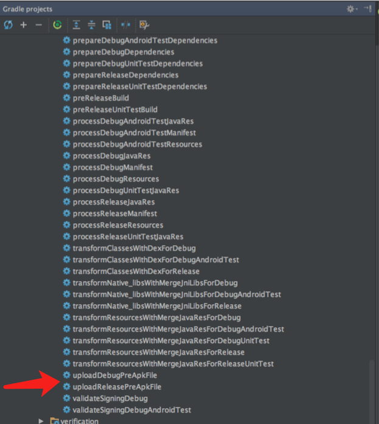
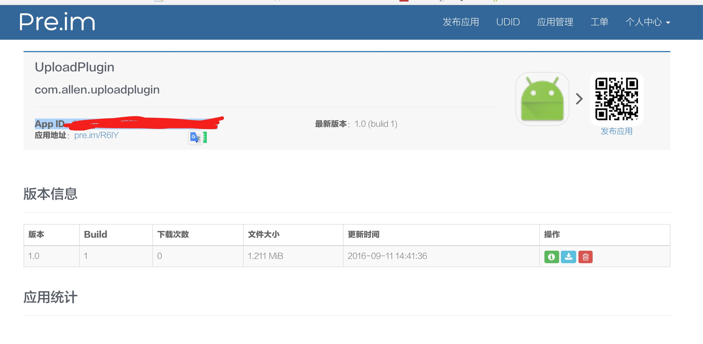

# Pre.im 插件使用说明


[官网链接，一款内测分发平台](http://pre.im/)


在根目录下的build.gralde文件的depandencies（buildscript部分）中添加：


```groovy
 dependencies {
        classpath 'com.pre.im:preuploader:1.0.2'
    }
```


在module的build.gradle文件的顶部添加：

```
apply plugin: 'com.pre.im'

pre {
    user_key='<your user>'
    password='<下载密码 (传空字符串或不传则不设置密码)>'
    update_notify="<向内测成员发布新版通知 (1:开启)>"
}

```


`<Project>/build.gradle`文件如下：

```
buildscript {
        repositories {
            jcenter()
        }
        dependencies {
            ...
            classpath 'com.pre.im:preuploader:1.0.2'
        }
    }}
```

`<Project>/<Module>/build.gradle`文件如下：
```
apply plugin: 'com.pre.im'
pre {
    user_key='a33333333333rrrr4ddeeeeeeedd'
    password='1222222'
    update_notify="1"
}
```

项目应用了Pre插件之后，插件默认是开启的，会在工程Gradle projects生成以下两个task：



可以直接点击执行或者在命令行输入以下命令：

```
gradle uploadReleasePreApkFile
```

上传成功之后就可以在内测平台看到版本信息：


 Thanks [Bugly](https://bugly.qq.com/betaGradle),
 		[BuglyDevTeam](https://github.com/BuglyDevTeam/BuglyBetaUploader),
 		[IT_xiao小巫 ](http://www.jianshu.com/p/7e8ae21b093a)

## License
```
Copyright 2016 AllenCoder

Licensed under the Apache License, Version 2.0 (the "License");
you may not use this file except in compliance with the License.
You may obtain a copy of the License at

   http://www.apache.org/licenses/LICENSE-2.0

Unless required by applicable law or agreed to in writing, software
distributed under the License is distributed on an "AS IS" BASIS,
WITHOUT WARRANTIES OR CONDITIONS OF ANY KIND, either express or implied.
See the License for the specific language governing permissions and
limitations under the License.
```


